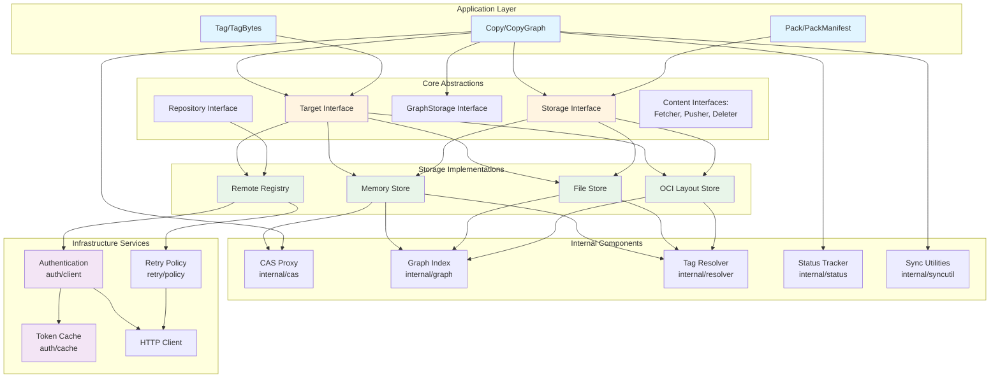
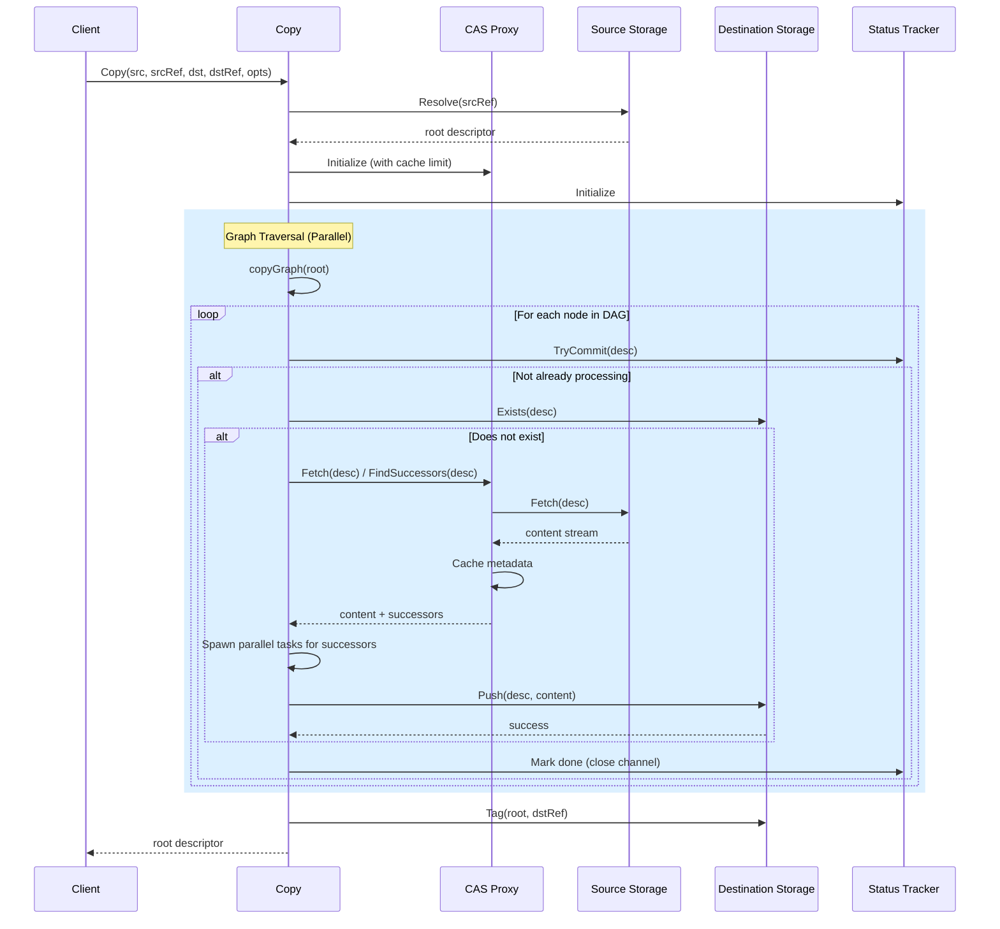
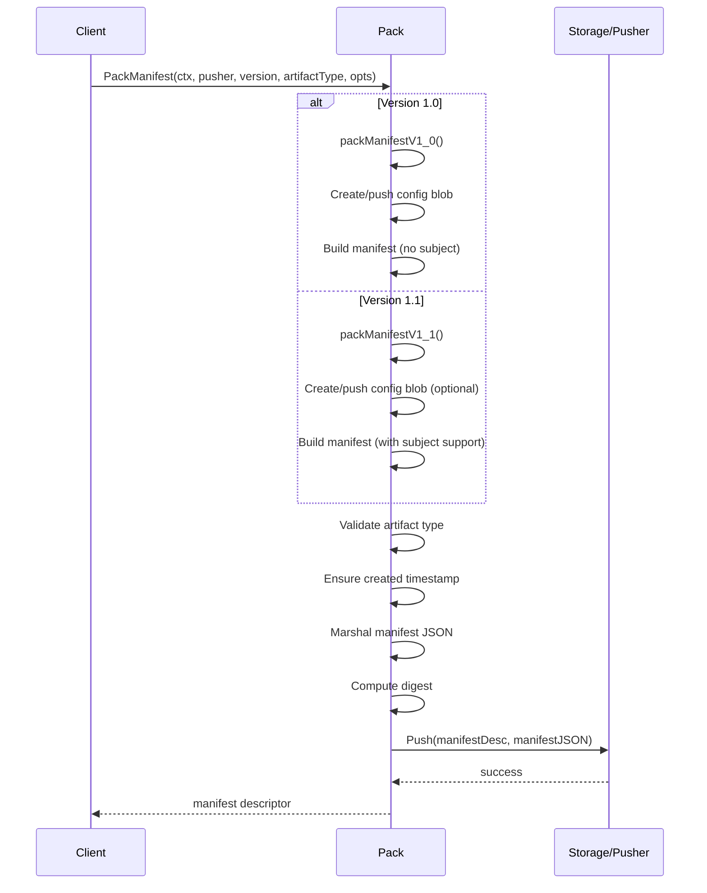
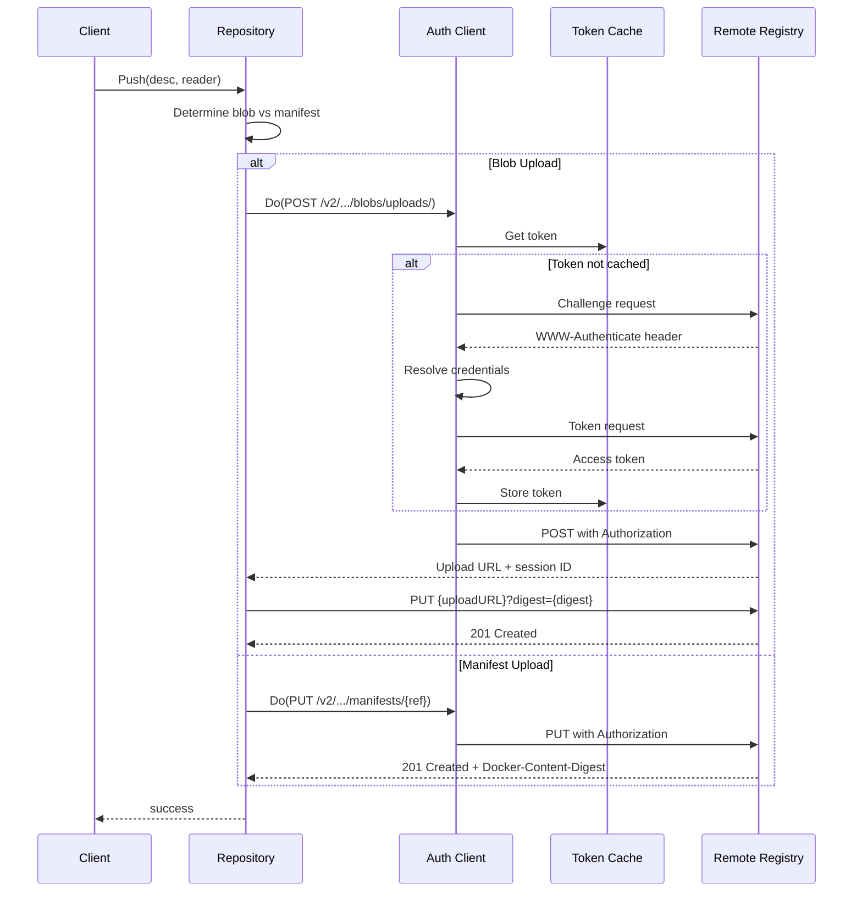
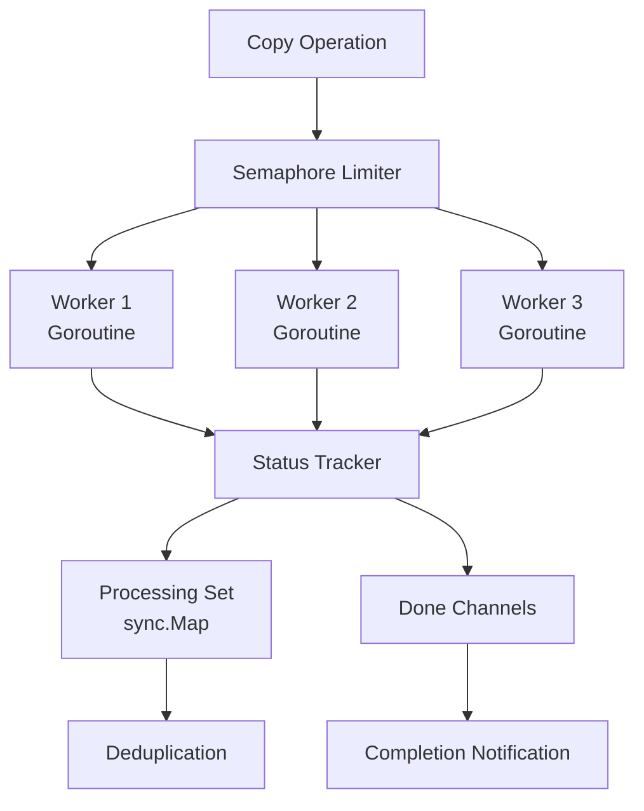
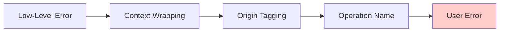

# Component Diagram

**Reading Time**: ~10 min  
**Analysis Phase**: 2 - Architecture  
**Level**: Architecture  
**Confidence**: [H] High (95%)

## Context

This document provides a detailed component diagram and interaction analysis for the ORAS Go library. It illustrates how different components communicate, data flows through the system, and the relationships between layers.

## Related Documentation

⬆️ [Architecture Overview](01-architecture.md) | ↔️ [Overview Section](../01-overview/01-project-goal.md) | ⬇️ [Modules Section](../03-modules/)

---

## Component Diagram



---

## Component Descriptions

| Component | Responsibility | Key Files |
|-----------|---------------|-----------|
| **Copy/CopyGraph** | Artifact DAG copying with concurrency control | [copy.go](../../../copy.go), [extendedcopy.go](../../../extendedcopy.go) |
| **Pack/PackManifest** | Manifest creation and versioning | [pack.go](../../../pack.go) |
| **Target** | CAS + tagging abstraction | [target.go](../../../target.go) |
| **Storage** | Content-addressable storage abstraction | [content/storage.go](../../../content/storage.go) |
| **Memory Store** | In-memory implementation | [content/memory/memory.go](../../../content/memory/memory.go) |
| **File Store** | File system implementation | [content/file/file.go](../../../content/file/file.go) |
| **OCI Store** | OCI Layout implementation | [content/oci/oci.go](../../../content/oci/oci.go) |
| **Remote Registry** | HTTP-based registry client | [registry/remote/repository.go](../../../registry/remote/repository.go) |
| **CAS Proxy** | Transparent caching layer | [internal/cas/proxy.go](../../../internal/cas/proxy.go) |
| **Graph Index** | Predecessor relationship tracking | [internal/graph/memory.go](../../../internal/graph/memory.go) |
| **Auth Client** | Authentication and authorization | [registry/remote/auth/client.go](../../../registry/remote/auth/client.go) |
| **Status Tracker** | Duplicate operation prevention | [internal/status/tracker.go](../../../internal/status/tracker.go) |

---

## Data Flow: Copy Operation

### Sequence Diagram



### Key Data Flow Characteristics

1. **Lazy Fetching**: Content fetched only when needed
2. **Metadata Caching**: Small manifests cached in proxy (≤4 MiB default)
3. **Parallel Traversal**: Concurrent processing via semaphore (default: 3 workers)
4. **Deduplication**: Status tracker prevents duplicate work
5. **Streaming**: Large blobs streamed without full buffering

**Reference**: [copy.go](../../../copy.go#L132-L273)

---

## Data Flow: Pack Operation

### Sequence Diagram



### Data Transformations

1. **Config Generation**: Empty config or custom descriptor
2. **Annotation Processing**: Timestamp injection (RFC 3339 format)
3. **Manifest Marshaling**: JSON serialization
4. **Digest Calculation**: SHA256 content addressing
5. **Descriptor Creation**: MediaType + Size + Digest

**Reference**: [pack.go](../../../pack.go#L139-L306)

---

## Data Flow: Remote Registry

### Sequence Diagram



### Key Features

1. **Chunked Upload**: Blob streaming support
2. **Token Caching**: Reduces auth overhead
3. **Retry Logic**: Automatic retry on transient failures
4. **Mount Optimization**: Cross-repository blob mounting
5. **Referrers API**: Subject-based artifact queries

**Reference**: [registry/remote/repository.go](../../../registry/remote/repository.go#L1-L150)

---

## Concurrency Control Flow



### Concurrency Components

1. **Semaphore Limiter** (`golang.org/x/sync/semaphore`)
   - Default concurrency: 3 (configurable)
   - Prevents resource exhaustion
   - Fair scheduling

2. **Status Tracker** ([internal/status/tracker.go](../../../internal/status/tracker.go))
   - Descriptor-based work tracking
   - `sync.Map` for concurrent access
   - Channel-based completion signaling

3. **Limited Regions** ([internal/syncutil/](../../../internal/syncutil/))
   - Scoped concurrency control
   - Deadlock prevention
   - Hierarchical task spawning

**Reference**: [copy.go](../../../copy.go#L188-L211)

---

## Storage Backend Selection

### Decision Matrix

| Backend | Use Case | Persistence | Performance | Network |
|---------|----------|-------------|-------------|---------|
| Memory | Testing, caching | None | High | N/A |
| File | Local storage, custom layout | Yes | Medium | N/A |
| OCI | Standard OCI layout | Yes | Medium | N/A |
| Remote | Registry operations | Remote | Low | Required |

---

## Interface Hierarchy

```
Fetcher
├── ReadOnlyStorage
│   ├── Storage
│   │   ├── GraphStorage
│   │   └── Deleter
│   └── ReadOnlyGraphStorage
│       └── GraphStorage
└── Resolver
    ├── TagResolver
    │   ├── Target
    │   │   └── GraphTarget
    │   └── Tagger
    └── ReferenceResolver

Repository
├── Storage
├── Deleter
├── TagResolver
├── ReferenceFetcher
├── ReferencePusher
├── ReferrerLister
└── TagLister
```

---

## Error Handling Flow

### Error Categories

```go
// Custom error types
type CopyError struct {
    Err    error
    Origin CopyErrorOrigin  // Source or Destination
}

// Standard errors
var (
    ErrSkipNode              = errors.New("skip node")
    ErrInvalidDateTimeFormat = errors.New("invalid date and time format")
    ErrMissingArtifactType   = errors.New("missing artifact type")
)
```

### Error Propagation



**Features**:
- Error origin tracking (source vs. destination)
- Operation context preservation
- Standardized error types via `errdef` package

**Reference**: [copyerror.go](../../../copyerror.go)

---

## Performance Optimization Strategies

### 1. Metadata Caching

**Implementation**: [internal/cas/proxy.go](../../../internal/cas/proxy.go)

- Default 4 MiB cache for small manifests
- Reduces redundant network fetches
- Memory-bounded to prevent OOM

### 2. Lazy Evaluation

- Content fetched only when needed
- Successor discovery on-demand
- Conditional pushes (skip if exists)

### 3. Streaming I/O

- `io.Reader`/`io.Writer` interfaces
- No full buffering for large blobs
- Buffer pooling for file operations

### 4. Parallel Graph Traversal

- Concurrent node processing
- Semaphore-based rate limiting
- Work deduplication

**Reference**: [copy.go](../../../copy.go#L191-L211)

### Resource Limits

| Resource | Default Limit | Configurable |
|----------|---------------|--------------|
| Concurrency | 3 workers | Yes (`CopyGraphOptions.Concurrency`) |
| Metadata Cache | 4 MiB | Yes (`CopyGraphOptions.MaxMetadataBytes`) |
| API Response | 4 MiB | Yes (`Repository.MaxMetadataBytes`) |
| Auth Response | 128 KiB | No (hardcoded) |

---

## Extensibility Points

### 1. Custom Storage Backends

Implement core interfaces:

```go
type MyStorage struct {}

func (s *MyStorage) Fetch(ctx context.Context, desc Descriptor) (io.ReadCloser, error) {...}
func (s *MyStorage) Push(ctx context.Context, desc Descriptor, r io.Reader) error {...}
func (s *MyStorage) Exists(ctx context.Context, desc Descriptor) (bool, error) {...}
```

### 2. Custom Credential Providers

```go
func CustomCredential(ctx context.Context, hostport string) (auth.Credential, error) {
    // Fetch from secret manager, environment, etc.
    return auth.Credential{Username: "...", Password: "..."}, nil
}

client.Credential = CustomCredential
```

### 3. Hook Points in Copy Operations

```go
opts := CopyGraphOptions{
    PreCopy: func(ctx, desc) error {
        // Custom logic before copying each node
        // Return SkipNode to skip
    },
    PostCopy: func(ctx, desc) error {
        // Custom logic after copying each node
    },
    OnCopySkipped: func(ctx, desc) error {
        // Custom logic when node already exists
    },
}
```

**Reference**: [copy.go](../../../copy.go#L97-L118)

---

## Deployment Scenarios

### 1. Registry-to-Registry Copy

```go
srcRepo := remote.NewRepository("src.io/repo")
dstRepo := remote.NewRepository("dst.io/repo")
oras.Copy(ctx, srcRepo, "v1.0", dstRepo, "v1.0", opts)
```

### 2. Registry-to-Local

```go
repo := remote.NewRepository("ghcr.io/repo")
store, _ := oci.New("./artifacts")
oras.Copy(ctx, repo, "latest", store, "latest", opts)
```

### 3. Local Build and Push

```go
store, _ := file.New("./build")
repo := remote.NewRepository("ghcr.io/repo")
desc := oras.Pack(ctx, store, "app/type", layers, opts)
oras.Copy(ctx, store, desc.Digest, repo, "v1.0", opts)
```

### 4. Artifact Signing Workflow

```go
// Pull artifact
oras.Copy(ctx, repo, "v1.0", memory, "temp", opts)

// Sign (notation integrates here)
signature := signArtifact(artifact)

// Push signature with subject reference
oras.Pack(ctx, repo, "signature/type", [signature], opts)
```

---

## Next Steps

- [Architecture Overview](01-architecture.md) - Layer descriptions and patterns
- [Module Analysis](../03-modules/) - Deep dive into individual modules

---

## Citations

**Source Document**: [phase-2-findings.md](../.workspace/phase-2-findings.md) - Section 2  
**Analysis Date**: December 16, 2025  
**Confidence Level**: 95%
