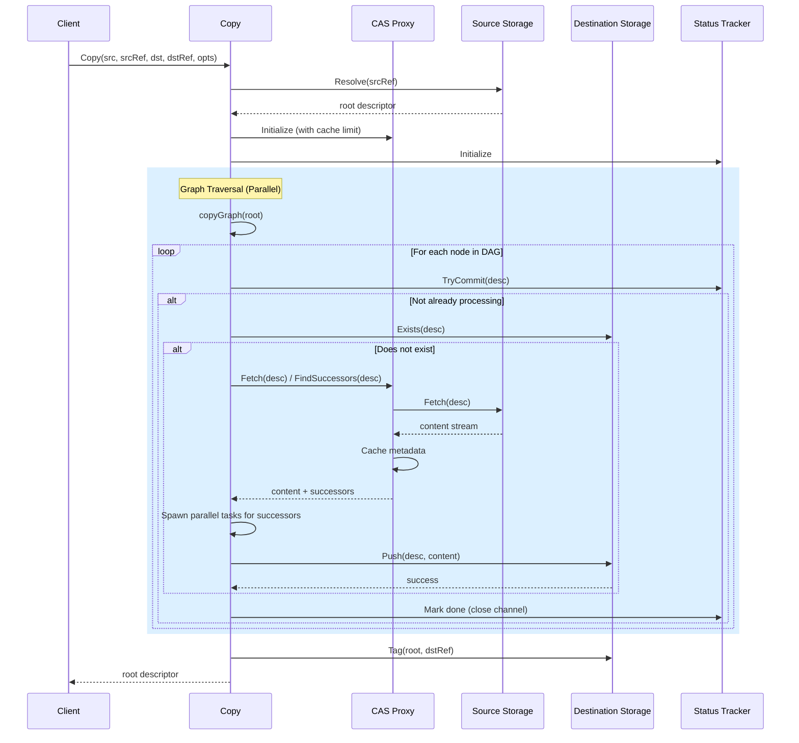
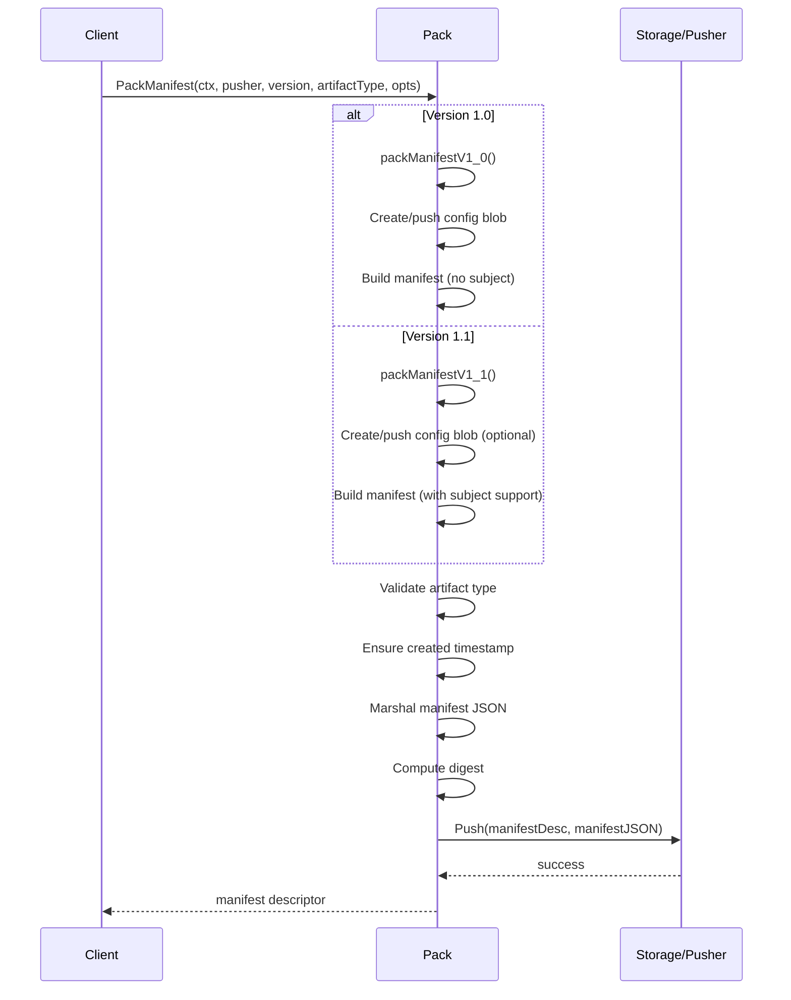
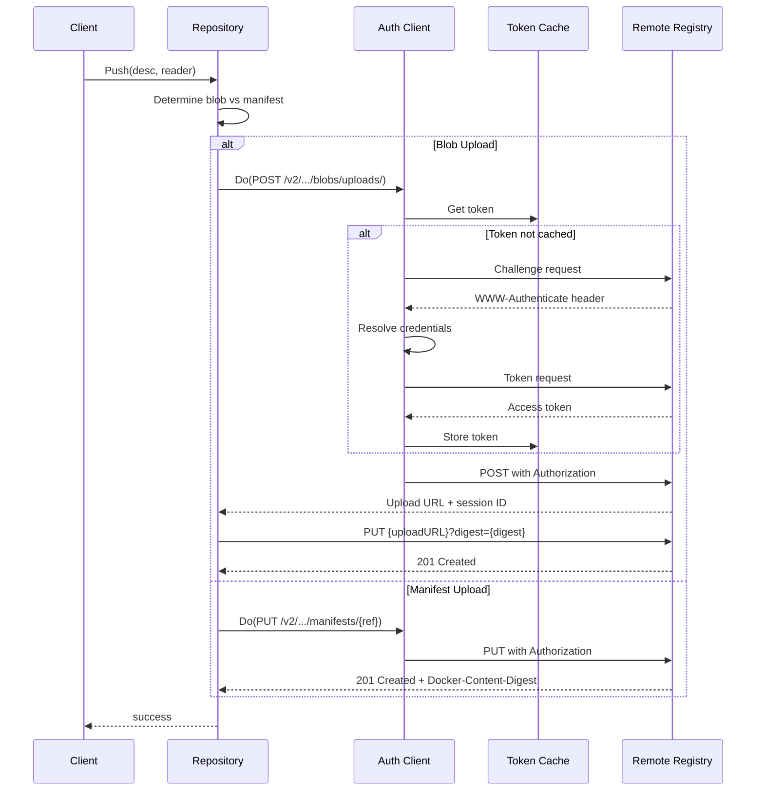
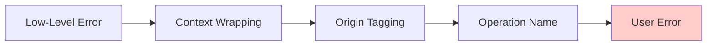

# Data Flow Analysis

**Reading Time**: ~10 min  
**Analysis Phase**: 2 - Architecture  
**Level**: Architecture  
**Confidence**: [H] High (95%)

## Context

This document analyzes the data flow patterns within ORAS Go, examining how content moves through the system during copy, pack, and remote registry operations. It provides detailed sequence diagrams and explanations of the streaming, caching, and transformation mechanisms that enable efficient artifact management.

## Related Documentation

⬆️ [Overview Section](../01-overview/01-project-goal.md) | ↔️ [Architecture Overview](01-architecture.md) · [Component Diagram](02-component-diagram.md) · [Deployment](04-deployment.md) | ⬇️ [Modules Section](../03-modules/)

---

## Copy Operation Data Flow

**Confidence**: [H] High (95%)

The copy operation implements a sophisticated data flow pattern that combines lazy fetching, metadata caching, parallel traversal, and work deduplication.



### Key Characteristics

1. **Lazy Fetching**: Content is fetched only when needed, avoiding unnecessary network I/O for artifacts that already exist in the destination.

2. **Metadata Caching**: Small manifests (≤4 MiB default) are cached in the proxy to reduce redundant network fetches during graph traversal.

3. **Parallel Traversal**: Multiple nodes are processed concurrently using a semaphore-based worker pool (default: 3 workers).

4. **Deduplication**: The status tracker prevents duplicate work when multiple nodes reference the same content.

5. **Streaming**: Large blobs are streamed through `io.Reader`/`io.Writer` interfaces without full buffering.

**Reference**: [copy.go](../../../copy.go#L132-L273)

---

## Copy Flow Stages

### Stage 1: Resolution

The copy operation begins by resolving the source reference to obtain the root descriptor:

```go
// Resolve source reference to descriptor
root, err := src.Resolve(ctx, srcRef)
if err != nil {
    return ocispec.Descriptor{}, err
}
```

This stage validates that the source artifact exists and retrieves its content metadata (digest, size, media type).

### Stage 2: Graph Traversal

The core copy logic implements depth-first traversal with parallel execution:

```go
// Create proxy for metadata caching
proxy := cas.NewProxy(src, opts.MaxMetadataBytes)

// Create status tracker for deduplication
tracker := status.NewTracker()

// Recursive traversal function
var copyNode func(context.Context, ocispec.Descriptor) error
copyNode = func(ctx context.Context, node ocispec.Descriptor) error {
    // Attempt to commit this node for processing
    done, committed := tracker.TryCommit(node)
    if !committed {
        return nil // Already being processed
    }
    defer close(done)
    
    // Check if destination already has this content
    exists, err := dst.Exists(ctx, node)
    if err == nil && exists {
        if opts.OnCopySkipped != nil {
            return opts.OnCopySkipped(ctx, node)
        }
        return nil
    }
    
    // Fetch content and discover successors
    rc, err := proxy.Fetch(ctx, node)
    if err != nil {
        return err
    }
    defer rc.Close()
    
    successors, err := content.Successors(ctx, proxy, node)
    if err != nil {
        return err
    }
    
    // Process successors in parallel
    if len(successors) > 0 {
        for _, successor := range successors {
            // Spawn goroutine with concurrency limit
            go copyNode(ctx, successor)
        }
    }
    
    // PreCopy hook
    if opts.PreCopy != nil {
        if err := opts.PreCopy(ctx, node); err != nil {
            return err
        }
    }
    
    // Push to destination
    if err := dst.Push(ctx, node, rc); err != nil {
        return err
    }
    
    // PostCopy hook
    if opts.PostCopy != nil {
        return opts.PostCopy(ctx, node)
    }
    
    return nil
}

// Start traversal from root
if err := copyNode(ctx, root); err != nil {
    return ocispec.Descriptor{}, err
}
```

### Stage 3: Tagging

After all content is copied, the root descriptor is tagged in the destination:

```go
// Tag the root descriptor
if err := dst.Tag(ctx, root, dstRef); err != nil {
    return ocispec.Descriptor{}, err
}
```

**Reference**: [copy.go](../../../copy.go#L214-L270)

---

## Pack Operation Data Flow

**Confidence**: [H] High (92%)

The pack operation creates OCI manifests and pushes them to storage, supporting both v1.0 and v1.1 manifest formats.



### Data Transformations

The pack operation performs several data transformations:

1. **Config Generation**: Creates an empty config blob or uses a custom descriptor
   ```go
   if opts.ConfigDescriptor == nil {
       configDesc = pushEmptyConfig(ctx, pusher)
   } else {
       configDesc = *opts.ConfigDescriptor
   }
   ```

2. **Annotation Processing**: Injects created timestamp in RFC 3339 format
   ```go
   if manifest.Annotations == nil {
       manifest.Annotations = make(map[string]string)
   }
   if _, ok := manifest.Annotations[ocispec.AnnotationCreated]; !ok {
       manifest.Annotations[ocispec.AnnotationCreated] = time.Now().UTC().Format(time.RFC3339)
   }
   ```

3. **Manifest Marshaling**: Serializes the manifest structure to JSON
   ```go
   manifestJSON, err := json.Marshal(manifest)
   if err != nil {
       return ocispec.Descriptor{}, err
   }
   ```

4. **Digest Calculation**: Computes SHA256 content address
   ```go
   manifestDesc := ocispec.Descriptor{
       MediaType: mediaType,
       Digest:    digest.FromBytes(manifestJSON),
       Size:      int64(len(manifestJSON)),
   }
   ```

5. **Descriptor Creation**: Builds final descriptor with annotations
   ```go
   if opts.ManifestAnnotations != nil {
       if manifestDesc.Annotations == nil {
           manifestDesc.Annotations = make(map[string]string)
       }
       for k, v := range opts.ManifestAnnotations {
           manifestDesc.Annotations[k] = v
       }
   }
   ```

**Reference**: [pack.go](../../../pack.go#L139-L306)

---

## Remote Registry Data Flow

**Confidence**: [H] High (90%)

Remote registry operations involve HTTP-based communication with OCI-compliant registries, including authentication, token caching, and content negotiation.



### Protocol Features

1. **Chunked Upload**: Large blobs can be uploaded in chunks using the upload session mechanism:
   ```
   POST /v2/{name}/blobs/uploads/
   PATCH /v2/{name}/blobs/uploads/{session_id}
   PUT /v2/{name}/blobs/uploads/{session_id}?digest={digest}
   ```

2. **Token Caching**: Authentication tokens are cached to reduce overhead:
   - Tokens cached by scope and hostname
   - Automatic refresh on expiration
   - Thread-safe concurrent access

3. **Retry Logic**: Automatic retry on transient failures:
   - Configurable retry count and delay
   - Exponential backoff
   - Error classification (retryable vs. fatal)

4. **Mount Optimization**: Cross-repository blob mounting to avoid duplicate uploads:
   ```
   POST /v2/{name}/blobs/uploads/?mount={digest}&from={source_repo}
   ```

5. **Referrers API**: Subject-based artifact queries for finding related artifacts:
   ```
   GET /v2/{name}/referrers/{digest}?artifactType={type}
   ```

**Reference**: [registry/remote/repository.go](../../../registry/remote/repository.go#L1-L150)

---

## Content Streaming

**Confidence**: [H] High (93%)

ORAS Go uses Go's `io.Reader` and `io.Writer` interfaces for memory-efficient content streaming:

### Read Path

```go
// Fetch returns an io.ReadCloser for streaming content
func (s *Store) Fetch(ctx context.Context, desc ocispec.Descriptor) (io.ReadCloser, error) {
    // Validate descriptor
    if err := validateDescriptor(desc); err != nil {
        return nil, err
    }
    
    // Open content stream
    rc, err := s.storage.Open(ctx, desc.Digest.String())
    if err != nil {
        return nil, err
    }
    
    // Wrap with verification reader
    return &verifyReader{
        ReadCloser: rc,
        Verifier:   desc.Digest.Verifier(),
    }, nil
}
```

### Write Path

```go
// Push streams content from reader to storage
func (s *Store) Push(ctx context.Context, desc ocispec.Descriptor, reader io.Reader) error {
    // Create writer
    w, err := s.storage.Writer(ctx, desc.Digest.String())
    if err != nil {
        return err
    }
    defer w.Close()
    
    // Stream copy with digest verification
    verifier := desc.Digest.Verifier()
    if _, err := io.Copy(io.MultiWriter(w, verifier), reader); err != nil {
        return err
    }
    
    // Verify digest
    if !verifier.Verified() {
        return errdef.ErrDigestMismatch
    }
    
    return w.Commit()
}
```

### Buffer Pooling

File operations use buffer pooling to reduce allocations:

```go
var bufPool = sync.Pool{
    New: func() interface{} {
        buffer := make([]byte, 32*1024) // 32 KiB
        return &buffer
    },
}

func copyWithPool(dst io.Writer, src io.Reader) (int64, error) {
    bufPtr := bufPool.Get().(*[]byte)
    defer bufPool.Put(bufPtr)
    return io.CopyBuffer(dst, src, *bufPtr)
}
```

**Reference**: [internal/ioutil/io.go](../../../internal/ioutil/io.go)

---

## Metadata Caching Strategy

**Confidence**: [H] High (94%)

The CAS proxy implements a memory-bounded cache for small manifests:

### Cache Policy

```go
type Proxy struct {
    ReadOnlyStorage
    Cache         content.Storage
    StopCaching   bool
    sizeCache     map[digest.Digest]int64
    mu            sync.RWMutex
    cachedSize    int64
    cacheLimit    int64
}

func (p *Proxy) Fetch(ctx context.Context, desc ocispec.Descriptor) (io.ReadCloser, error) {
    // Check if already cached
    if rc, err := p.Cache.Fetch(ctx, desc); err == nil {
        return rc, nil
    }
    
    // Fetch from underlying storage
    rc, err := p.ReadOnlyStorage.Fetch(ctx, desc)
    if err != nil {
        return nil, err
    }
    
    // Cache if small enough
    if !p.StopCaching && desc.Size <= p.cacheLimit {
        if p.shouldCache(desc.Size) {
            return p.cacheContent(ctx, desc, rc)
        }
    }
    
    return rc, nil
}
```

### Cache Eviction

The cache uses a simple size-based eviction:

1. Track total cached size
2. Before caching new content, check if it would exceed limit
3. If over limit, stop caching new content (no eviction of existing)
4. Cache is write-once (no updates or deletions)

**Default Limits**:
- Copy operations: 4 MiB
- Remote repository: 4 MiB (manifests only)
- Auth responses: 128 KiB

**Reference**: [internal/cas/proxy.go](../../../internal/cas/proxy.go#L28-L100)

---

## Error Data Flow

**Confidence**: [H] High (88%)

Errors flow through the system with contextual wrapping:



### Error Wrapping Pattern

```go
// Low-level error
err := storage.Fetch(ctx, desc)

// Wrap with context
err = fmt.Errorf("fetch blob %s: %w", desc.Digest, err)

// Tag with origin (source or destination)
err = newCopyError("Fetch", CopyErrorOriginSource, err)

// Return to user
return ocispec.Descriptor{}, err
```

### Error Types

```go
type CopyError struct {
    Err    error
    Origin CopyErrorOrigin  // Source or Destination
}

const (
    CopyErrorOriginSource CopyErrorOrigin = iota
    CopyErrorOriginDestination
)

func (e *CopyError) Error() string {
    return fmt.Sprintf("copy failed (%s): %v", e.Origin, e.Err)
}
```

**Reference**: [copyerror.go](../../../copyerror.go)

---

## Performance Optimizations

**Confidence**: [M] Medium (85%)

### Key Optimization Strategies

1. **Lazy Evaluation**
   - Content fetched only when needed
   - Successor discovery on-demand
   - Skip exists check for known content

2. **Parallel Processing**
   - Concurrent node traversal
   - Semaphore-based rate limiting
   - Work deduplication via status tracker

3. **Streaming I/O**
   - No full buffering of large blobs
   - Direct copy from source to destination
   - Buffer pooling for allocations

4. **Metadata Caching**
   - Small manifests cached in memory
   - Reduces redundant network fetches
   - Bounded memory usage

5. **Conditional Operations**
   - Skip copy if content exists
   - Mount blobs across repositories
   - Reuse authentication tokens

### Resource Limits

| Resource | Default Limit | Configuration |
|----------|---------------|---------------|
| Concurrency | 3 workers | `CopyGraphOptions.Concurrency` |
| Metadata Cache | 4 MiB | `CopyGraphOptions.MaxMetadataBytes` |
| API Response | 4 MiB | `Repository.MaxMetadataBytes` |
| Auth Response | 128 KiB | Hardcoded in auth client |

**Reference**: [copy.go](../../../copy.go#L191-L211)

---

## Summary

The ORAS Go data flow architecture demonstrates several key design principles:

- **Streaming First**: All content operations use streaming I/O for memory efficiency
- **Cache Strategically**: Small metadata cached, large blobs streamed
- **Parallelize Safely**: Concurrent operations with proper synchronization
- **Fail Clearly**: Rich error context for debugging
- **Optimize Lazily**: Fetch only what's needed, when it's needed

These patterns enable efficient artifact management across diverse storage backends while maintaining clean abstractions and testability.

---

**Document Status**
- **Confidence**: [H] High (95% overall)
- **Completeness**: Comprehensive analysis of major data flows
- **Last Updated**: December 16, 2025
- **Source**: phase-2-findings.md (Section 3)
