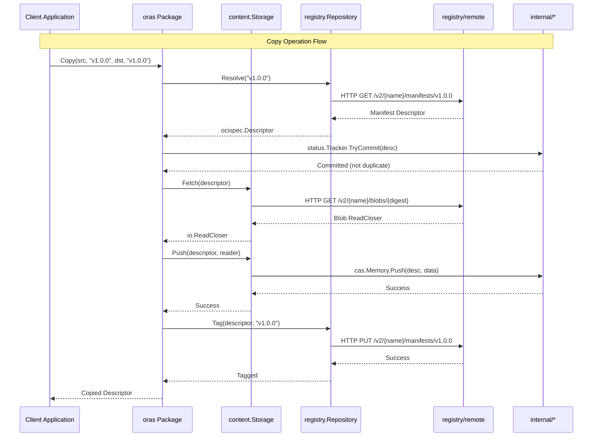
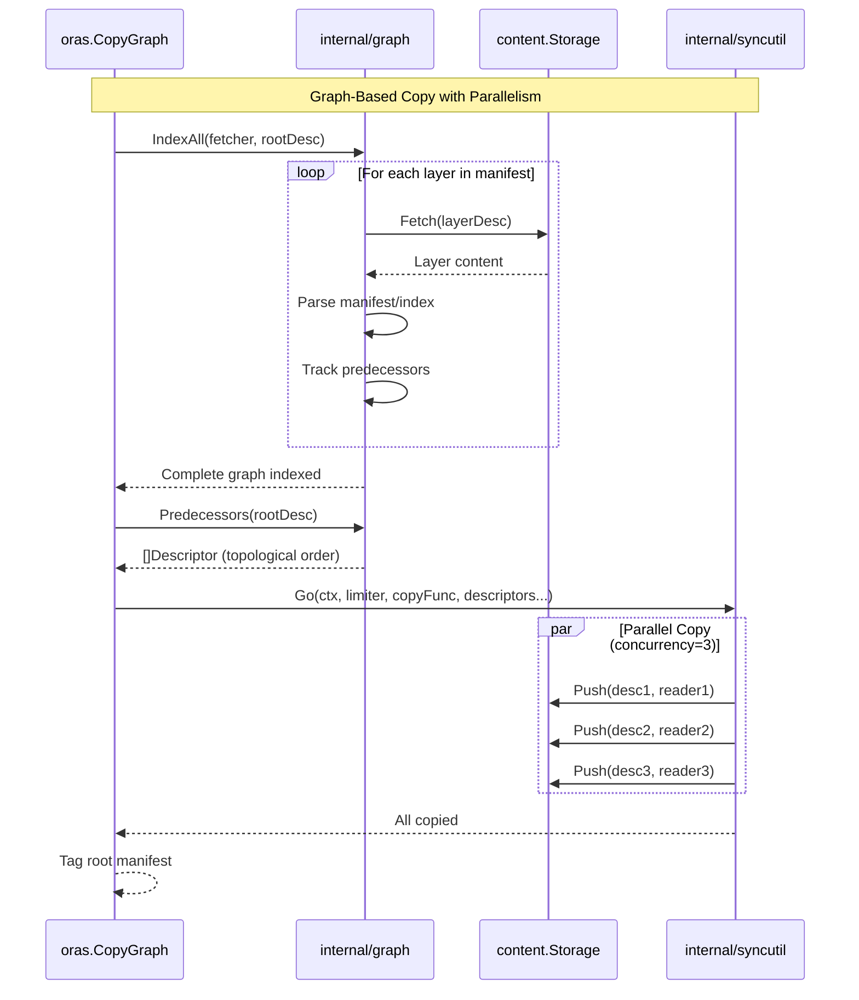

# Module Interactions

**Reading Time**: ~12 min  
**Analysis Phase**: 3 - Modules  
**Level**: Modules  
**Confidence**: [H] High (95%)

## Context

This document details how the ORAS Go library modules communicate with each other to accomplish OCI artifact operations. Understanding these interactions is crucial for implementing features, debugging issues, and maintaining the codebase. The library uses interface-based communication, context propagation, and descriptor-based data flow to enable flexible, testable operations across multiple storage backends.

## Related Documentation

⬆️ [Architecture Overview](../02-architecture/01-architecture.md) | ↔️ [Module Map](01-module-map.md) | ⬇️ Implementation Details

---

## Communication Patterns

### Pattern Overview

ORAS Go employs three primary communication mechanisms between modules:

1. **Interface-Based Communication** - Dependency injection through interfaces
2. **Context-Based Communication** - Cancellation and request-scoped values
3. **Descriptor-Based Communication** - Data identified by OCI descriptors

These patterns enable loose coupling, testability, and flexibility across the architecture.

---

## Interaction Flow Diagram

### High-Level Operation Flow



### Graph Traversal Flow



---

## Communication Mechanism 1: Interface-Based

### Overview

The primary communication pattern in ORAS Go is through well-defined interfaces. This enables:

- **Loose coupling** between modules
- **Multiple implementations** of the same interface
- **Easy testing** with mock implementations
- **Extensibility** for custom backends

### Key Interfaces

#### Target Interface (oras → content)

The `Target` interface abstracts storage destinations:

```go
// Defined in: target.go
type Target interface {
    content.Storage      // Fetch, Push, Exists, Delete
    content.TagResolver  // Resolve, Tag
}
```

**Usage Example**:

```go
// Any type implementing Target can be used
var target oras.Target

// Use in-memory storage
target = memory.New()

// Or use OCI layout storage
target, _ = oci.New("/path/to/layout")

// Same operation works with both
desc, err := oras.Copy(ctx, src, "v1", target, "v1", opts)
```

**Communication Flow**:
1. High-level `oras` functions accept `Target` interface
2. Underlying storage implementation provides concrete types
3. Operations work uniformly across implementations

**Reference**: [target.go](../../../target.go#L20-L33)

#### Storage Interface (content → implementations)

```go
// Defined in: content/storage.go
type Storage interface {
    ReadOnlyStorage
    Pusher
}

type ReadOnlyStorage interface {
    Fetcher
    Exists(ctx context.Context, target ocispec.Descriptor) (bool, error)
}

type Fetcher interface {
    Fetch(ctx context.Context, target ocispec.Descriptor) (io.ReadCloser, error)
}

type Pusher interface {
    Push(ctx context.Context, expected ocispec.Descriptor, content io.Reader) error
}
```

**Implementations**:
- `content/memory.Store` - In-memory
- `content/file.Store` - File system
- `content/oci.Store` - OCI layout
- `registry/remote.Repository` - Remote registry

**Reference**: [content/storage.go](../../../content/storage.go#L23-L53)

#### Repository Interface (registry → remote)

```go
// Defined in: registry/repository.go
type Repository interface {
    content.Storage           // Blob operations
    content.Deleter          // Delete operations
    content.TagResolver      // Tag operations
    ReferenceFetcher         // Fetch by reference
    ReferencePusher          // Push by reference
    ReferrerLister           // List referrers
    TagLister                // List tags
    Blobs() BlobStore        // Blob-specific operations
    Manifests() ManifestStore // Manifest-specific operations
}
```

**Usage**:

```go
// Connect to remote registry
registry, _ := remote.NewRegistry("registry.example.com")
repo, _ := registry.Repository(ctx, "myrepo")

// Repository implements content.Storage
var storage content.Storage = repo

// Can be used as Target for copy operations
desc, _ := oras.Copy(ctx, repo, "v1", dstStorage, "v1", opts)
```

**Reference**: [registry/repository.go](../../../registry/repository.go#L30-L56)

### Interface Composition Pattern

ORAS Go composes small interfaces into larger ones:

```go
// Small, focused interfaces
type Fetcher interface {
    Fetch(ctx, desc) (io.ReadCloser, error)
}

type Pusher interface {
    Push(ctx, desc, reader) error
}

// Composed into larger interface
type Storage interface {
    ReadOnlyStorage  // Contains Fetcher + Exists
    Pusher
}

// Further composed into GraphStorage
type GraphStorage interface {
    Storage
    PredecessorFinder  // Graph traversal capability
}
```

**Benefits**:
- Clients can require only the capabilities they need
- Easy to add new capabilities without breaking existing code
- Clear separation of concerns

---

## Communication Mechanism 2: Context-Based

### Context Propagation

All operations in ORAS Go accept `context.Context` as the first parameter:

```go
func Copy(ctx context.Context, src ReadOnlyTarget, srcRef string, 
          dst Target, dstRef string, opts CopyOptions) (ocispec.Descriptor, error)
```

### Purpose

1. **Cancellation** - Stop long-running operations
2. **Timeouts** - Enforce operation deadlines
3. **Request-scoped values** - Pass metadata through call stack
4. **Status tracking** - Progress reporting

### Context Usage Example

```go
// Client sets timeout
ctx, cancel := context.WithTimeout(context.Background(), 5*time.Minute)
defer cancel()

// Passed through all operations
desc, err := oras.Copy(ctx, src, "v1", dst, "v1", opts)

// If timeout expires, context is cancelled
// All downstream operations receive cancelled context
// Operations check ctx.Err() and return early
```

### Status Tracking via Context

```go
// Internal status tracker uses context
tracker := status.NewTracker()

// Try to commit work
committed, ch := tracker.TryCommit(descriptor)
if !committed {
    // Work already in progress, wait
    select {
    case <-ch:
        // Work completed by another goroutine
        return nil
    case <-ctx.Done():
        // Context cancelled
        return ctx.Err()
    }
}
```

**Reference**: [internal/status/tracker.go](../../../internal/status/tracker.go)

### Context Flow

```
Client Application
      │
      │ context.WithTimeout(ctx, 5*time.Minute)
      ▼
oras.Copy(ctx, ...)
      │
      │ Pass ctx to all operations
      ▼
content.Fetch(ctx, desc)
      │
      │ Check ctx.Err() before network calls
      ▼
remote.Repository.Fetch(ctx, desc)
      │
      │ HTTP request with ctx
      ▼
HTTP Client (req.WithContext(ctx))
      │
      │ Network I/O with context
      ▼
Response or ctx.Err()
```

---

## Communication Mechanism 3: Descriptor-Based

### OCI Descriptor as Data Contract

The `ocispec.Descriptor` is the central data structure flowing through all module boundaries:

```go
// From: github.com/opencontainers/image-spec/specs-go/v1
type Descriptor struct {
    MediaType   string            `json:"mediaType"`
    Digest      digest.Digest     `json:"digest"`
    Size        int64             `json:"size"`
    URLs        []string          `json:"urls,omitempty"`
    Annotations map[string]string `json:"annotations,omitempty"`
    Data        []byte            `json:"-"`
    Platform    *Platform         `json:"platform,omitempty"`
    ArtifactType string           `json:"artifactType,omitempty"`
}
```

### Descriptor Flow

```mermaid
graph LR
    A[Client] -->|reference "v1.0.0"| B[oras.Copy]
    B -->|Resolve| C[Registry]
    C -->|Descriptor| B
    B -->|Descriptor| D[Content.Fetch]
    D -->|Descriptor + Reader| E[Content.Push]
    E -->|Descriptor| F[Status Tracker]
    F -->|Descriptor| G[Graph Indexer]
    G -->|Predecessors| B
    B -->|Descriptor| H[Tag Operation]
    H -->|Final Descriptor| A
    
    style C fill:#FF9800
    style D fill:#2196F3
    style E fill:#2196F3
    style F fill:#9E9E9E
    style G fill:#9E9E9E
```

### Descriptor Usage Across Modules

#### 1. Resolution (registry → oras)
```go
// Registry resolves tag to descriptor
desc, err := repo.Resolve(ctx, "v1.0.0")
// Returns: ocispec.Descriptor{
//     MediaType: "application/vnd.oci.image.manifest.v1+json",
//     Digest:    "sha256:abc123...",
//     Size:      1234,
// }
```

#### 2. Fetching (oras → content)
```go
// Descriptor identifies content to fetch
reader, err := storage.Fetch(ctx, desc)
// Descriptor used to:
// - Locate content by digest
// - Verify size matches
// - Validate media type
```

#### 3. Pushing (oras → content)
```go
// Descriptor specifies expected content
err := storage.Push(ctx, desc, reader)
// Implementation:
// - Reads content from reader
// - Computes actual digest
// - Validates against desc.Digest
// - Checks size matches desc.Size
// - Stores with computed digest as key
```

#### 4. Graph Traversal (oras → internal/graph)
```go
// Descriptor represents graph node
err := graph.Index(ctx, fetcher, desc)
// Process:
// - Fetch content identified by desc
// - Parse manifest/index
// - Extract layer descriptors
// - Build predecessor relationships
```

#### 5. Deduplication (internal/status)
```go
// Descriptor used as unique key
committed, ch := tracker.TryCommit(desc)
// Uses digest.Digest from descriptor as map key
// Prevents duplicate work for same content
```

### Descriptor Validation

Throughout the flow, descriptors are validated:

```go
// In content.Push implementation
func (s *Store) Push(ctx context.Context, expected ocispec.Descriptor, r io.Reader) error {
    // Read content
    content, err := io.ReadAll(r)
    
    // Compute actual digest
    actual := digest.FromBytes(content)
    
    // Validate against expected
    if actual != expected.Digest {
        return errdef.ErrInvalidDigest
    }
    
    // Validate size
    if int64(len(content)) != expected.Size {
        return fmt.Errorf("size mismatch")
    }
    
    // Store with validated digest
    s.store[expected.Digest] = content
    return nil
}
```

**Reference**: Content validation pattern used throughout storage implementations

---

## Module Interaction Scenarios

### Scenario 1: Copy from Remote Registry to OCI Layout

**Operation**: `oras.Copy(ctx, remoteRepo, "v1.0.0", ociStore, "v1.0.0", opts)`

**Step-by-Step Interaction**:

```
1. oras.Copy receives source and destination Targets
   ├─ Source: registry/remote.Repository
   └─ Destination: content/oci.Store

2. oras → registry/remote: Resolve("v1.0.0")
   ├─ remote.Repository.Resolve(ctx, "v1.0.0")
   ├─ remote → HTTP GET /v2/{name}/manifests/v1.0.0
   └─ Returns: ocispec.Descriptor (manifest)

3. oras → internal/graph: Index manifest
   ├─ graph.IndexAll(ctx, remoteRepo, manifestDesc)
   ├─ graph → remoteRepo.Fetch(manifestDesc)
   ├─ Parses manifest JSON
   ├─ Extracts layer descriptors
   └─ Builds predecessor map

4. oras → internal/graph: Get copy order
   ├─ graph.Predecessors(ctx, manifestDesc)
   └─ Returns: [layerDesc1, layerDesc2, ..., manifestDesc]

5. oras → internal/syncutil: Parallel copy layers
   ├─ syncutil.Go(ctx, limiter, copyFunc, layerDescriptors)
   ├─ For each layer (max 3 concurrent):
   │   ├─ oras → remoteRepo.Fetch(layerDesc)
   │   │   └─ HTTP GET /v2/{name}/blobs/{digest}
   │   └─ oras → ociStore.Push(layerDesc, reader)
   │       ├─ Write to blobs/sha256/{digest}
   │       └─ Track in memory index
   └─ Wait for all to complete

6. oras → ociStore: Copy manifest
   ├─ oras → remoteRepo.Fetch(manifestDesc)
   ├─ oras → ociStore.Push(manifestDesc, reader)
   └─ Store in blobs/sha256/{digest}

7. oras → ociStore: Tag manifest
   ├─ oras → ociStore.Tag(ctx, manifestDesc, "v1.0.0")
   ├─ Update index.json with tag mapping
   └─ Auto-save if AutoSaveIndex=true

8. oras → Client: Return manifestDesc
```

**Module Communication Summary**:
- `oras` → `registry/remote`: Resolve, Fetch
- `oras` → `internal/graph`: Index, Predecessors
- `oras` → `internal/syncutil`: Parallel execution
- `oras` → `content/oci`: Push, Tag
- `registry/remote` → HTTP: Network requests
- `content/oci` → Filesystem: Blob storage

**Reference**: [copy.go](../../../copy.go) implementation

---

### Scenario 2: Pack Artifact with Layers

**Operation**: `oras.Pack(ctx, memStore, "application/vnd.example.config", opts)`

**Step-by-Step Interaction**:

```
1. oras.Pack receives Target and options
   └─ opts.Layers = [layer1Desc, layer2Desc, ...]

2. oras → oras: Generate config
   ├─ Create empty JSON config: {}
   ├─ Compute digest: sha256:44136fa355b3...
   └─ Create configDesc

3. oras → content/memory: Push config
   ├─ memStore.Push(ctx, configDesc, configReader)
   ├─ internal/cas.Memory.Push stores in sync.Map
   └─ Returns success

4. oras → oras: Assemble manifest
   ├─ Create manifest JSON:
   │   {
   │     "schemaVersion": 2,
   │     "mediaType": "application/vnd.oci.image.manifest.v1+json",
   │     "config": configDesc,
   │     "layers": [layer1Desc, layer2Desc, ...],
   │     "annotations": opts.Annotations
   │   }
   ├─ Marshal to JSON
   ├─ Compute digest
   └─ Create manifestDesc

5. oras → content/memory: Push manifest
   ├─ memStore.Push(ctx, manifestDesc, manifestReader)
   ├─ Store in CAS
   └─ Track in graph

6. oras → internal/graph: Index relationships
   ├─ graph.Index(ctx, memStore, manifestDesc)
   ├─ Mark config and layers as predecessors
   └─ Build graph structure

7. oras → content/memory: Tag (optional)
   └─ If opts.PackManifestOptions.ConfigAnnotationRefs:
       └─ memStore.Tag(ctx, manifestDesc, annotationRef)

8. oras → Client: Return manifestDesc
```

**Module Communication Summary**:
- `oras` → `content/memory`: Push config, Push manifest, Tag
- `oras` → `internal/graph`: Index predecessors
- `content/memory` → `internal/cas`: Store blobs
- `content/memory` → `internal/resolver`: Store tags

**Reference**: [pack.go](../../../pack.go) implementation

---

### Scenario 3: Authentication Flow

**Operation**: `remote.Repository.Fetch(ctx, blobDesc)` with authentication

**Step-by-Step Interaction**:

```
1. registry/remote.Repository.Fetch called
   └─ Need to fetch blob from registry

2. remote → remote/auth.Client: HTTP GET request
   ├─ client.Do(request)
   └─ No Authorization header (first attempt)

3. remote/auth → Registry: Send request
   ├─ HTTP GET /v2/{name}/blobs/{digest}
   └─ Registry returns 401 Unauthorized

4. remote/auth ← Registry: 401 with WWW-Authenticate
   └─ WWW-Authenticate: Bearer realm="...",service="...",scope="..."

5. remote/auth → remote/auth: Parse challenge
   ├─ Extract realm, service, scope
   └─ Determine auth method (Bearer/Basic)

6. remote/auth → remote/credentials: Get credentials
   ├─ credentialFunc(ctx, "registry.example.com")
   ├─ credentials.DynamicStore.Get(serverAddress)
   ├─ Check FileStore (Docker config.json)
   ├─ Check NativeStore (OS keychain)
   └─ Returns auth.Credential{Username, Password}

7. remote/auth → Auth Service: Request token
   ├─ HTTP GET <realm>?service=<service>&scope=<scope>
   ├─ With Basic Auth header
   └─ Returns: {token: "eyJ...", expires_in: 300}

8. remote/auth → remote/auth.Cache: Store token
   ├─ cache.Set(cacheKey, token)
   └─ Token valid for 300 seconds

9. remote/auth → Registry: Retry with token
   ├─ HTTP GET /v2/{name}/blobs/{digest}
   ├─ Authorization: Bearer eyJ...
   └─ Registry returns 200 OK with blob

10. remote/auth → remote.Repository: Return response
    └─ io.ReadCloser with blob content

11. remote.Repository → oras: Return ReadCloser
```

**Module Communication Summary**:
- `registry/remote` → `registry/remote/auth`: HTTP with auth
- `remote/auth` → `remote/credentials`: Get credentials
- `remote/credentials` → OS Keychain: Native storage
- `remote/auth` → Auth Service: Token exchange
- `remote/auth` → Cache: Token storage
- `remote/auth` → Registry: Authenticated request

**Reference**: [registry/remote/auth/client.go](../../../registry/remote/auth/client.go)

---

## Concurrency and Synchronization

### Concurrent Operations

ORAS Go uses several patterns for concurrent operations:

#### 1. Parallel Copy with Semaphore

```go
// From: internal/syncutil/limit.go
func Go[T any](ctx context.Context, limiter *semaphore.Weighted, 
               fn GoFunc[T], items ...T) error {
    
    eg, egCtx := errgroup.WithContext(ctx)
    
    for _, item := range items {
        item := item // Capture for goroutine
        
        eg.Go(func() error {
            // Acquire semaphore (blocks if limit reached)
            if err := limiter.Acquire(egCtx, 1); err != nil {
                return err
            }
            defer limiter.Release(1)
            
            // Execute function
            return fn(egCtx, item)
        })
    }
    
    return eg.Wait()  // Wait for all goroutines
}
```

**Usage in Copy**:

```go
// Default concurrency: 3
limiter := semaphore.NewWeighted(int64(opts.Concurrency))

// Copy layers in parallel
err := syncutil.Go(ctx, limiter, func(ctx context.Context, desc ocispec.Descriptor) error {
    reader, err := src.Fetch(ctx, desc)
    if err != nil {
        return err
    }
    defer reader.Close()
    
    return dst.Push(ctx, desc, reader)
}, layerDescriptors...)
```

**Reference**: [internal/syncutil/limit.go](../../../internal/syncutil/limit.go)

#### 2. Work Deduplication

```go
// From: internal/status/tracker.go
type Tracker struct {
    status sync.Map // map[descriptor.Descriptor]chan struct{}
}

func (t *Tracker) TryCommit(target ocispec.Descriptor) (committed chan struct{}, exist bool) {
    committed = make(chan struct{})
    
    // Try to store channel
    actual, loaded := t.status.LoadOrStore(descriptor.FromOCI(target), committed)
    if loaded {
        // Already in progress, return existing channel
        return actual.(chan struct{}), true
    }
    
    // First to commit this work
    return committed, false
}
```

**Usage**:

```go
// Try to commit descriptor copy
committed, exists := tracker.TryCommit(desc)
if exists {
    // Another goroutine is already copying, wait
    select {
    case <-committed:
        return nil  // Work completed
    case <-ctx.Done():
        return ctx.Err()
    }
}

// Perform the copy
defer close(committed)  // Signal completion
return copyDescriptor(ctx, desc)
```

**Reference**: [internal/status/tracker.go](../../../internal/status/tracker.go)

#### 3. Thread-Safe Graph Operations

```go
// From: internal/graph/memory.go
type Memory struct {
    nodes        map[descriptor.Descriptor]ocispec.Descriptor
    predecessors map[descriptor.Descriptor]set.Set[descriptor.Descriptor]
    lock         sync.RWMutex
}

func (m *Memory) Index(ctx context.Context, fetcher content.Fetcher, 
                       node ocispec.Descriptor) error {
    m.lock.Lock()
    defer m.lock.Unlock()
    
    // Safe to modify under write lock
    m.nodes[key] = node
    m.predecessors[key] = predecessorSet
    return nil
}

func (m *Memory) Predecessors(ctx context.Context, 
                              node ocispec.Descriptor) ([]ocispec.Descriptor, error) {
    m.lock.RLock()
    defer m.lock.RUnlock()
    
    // Safe to read under read lock
    return m.getPredecessors(node)
}
```

**Reference**: [internal/graph/memory.go](../../../internal/graph/memory.go)

---

## Error Handling and Propagation

### Error Flow

Errors propagate up through module boundaries using Go's standard error handling:

```
Remote Registry Error
         │
         │ HTTP 404 Not Found
         ▼
remote.Repository.Fetch returns error
         │
         │ Wrap with context
         ▼
oras.Copy receives error
         │
         │ Wrap with copy context
         ▼
Client receives error
         │
         │ errors.Is(err, errdef.ErrNotFound)
         ▼
Handle appropriately
```

### Sentinel Errors

```go
// From: errdef/errors.go
var (
    ErrNotFound = errors.New("not found")
    ErrAlreadyExists = errors.New("already exists")
    ErrInvalidDigest = errors.New("invalid digest")
)
```

**Usage**:

```go
// Module returns sentinel error
func (s *Store) Fetch(ctx context.Context, desc ocispec.Descriptor) (io.ReadCloser, error) {
    data, ok := s.storage[desc.Digest]
    if !ok {
        return nil, errdef.ErrNotFound
    }
    return io.NopCloser(bytes.NewReader(data)), nil
}

// Client checks with errors.Is
reader, err := storage.Fetch(ctx, desc)
if errors.Is(err, errdef.ErrNotFound) {
    // Handle missing content
}
```

**Reference**: [errdef/errors.go](../../../errdef/errors.go)

### Error Wrapping

Modules wrap errors with context:

```go
// In copy.go
if err := dst.Push(ctx, desc, reader); err != nil {
    return ocispec.Descriptor{}, fmt.Errorf("failed to push %s: %w", desc.Digest, err)
}

// Preserves original error for errors.Is checks
// Adds context for debugging
```

---

## Data Flow Patterns

### 1. Streaming Data Flow

Content is streamed, not buffered, for memory efficiency:

```
Remote Registry
      │
      │ HTTP GET (Content-Length: 100MB)
      ▼
io.ReadCloser
      │
      │ Stream through
      ▼
Verification Reader
      │
      │ Compute digest on-the-fly
      ▼
Destination Storage
      │
      │ Write directly
      ▼
Filesystem/Memory
```

**No intermediate buffering of large blobs**

### 2. Metadata Flow

Small metadata (manifests, configs) may be buffered:

```go
// Read all for parsing
manifestJSON, err := io.ReadAll(reader)

// Parse
var manifest ocispec.Manifest
json.Unmarshal(manifestJSON, &manifest)

// Extract layer descriptors
layers := manifest.Layers
```

**Size limits**: Default 4 MiB for metadata (configurable)

### 3. Parallel Data Flow

Multiple blobs copied concurrently:

```
Layer 1: Remote → [Fetch] → [Verify] → [Push] → OCI Store
Layer 2: Remote → [Fetch] → [Verify] → [Push] → OCI Store (parallel)
Layer 3: Remote → [Fetch] → [Verify] → [Push] → OCI Store (parallel)
                                                      │
                          Wait for all  ← ─ ─ ─ ─ ─ ─ ┘
                                │
                                ▼
Manifest: Remote → [Fetch] → [Push] → OCI Store
```

**Concurrency control**: Semaphore limits parallel operations

---

## Extension Points

### Custom Storage Backend

Implement `content.Storage` interface:

```go
type CustomStorage struct {
    // Your implementation
}

func (s *CustomStorage) Fetch(ctx context.Context, desc ocispec.Descriptor) (io.ReadCloser, error) {
    // Fetch from your backend
}

func (s *CustomStorage) Push(ctx context.Context, desc ocispec.Descriptor, r io.Reader) error {
    // Push to your backend
}

func (s *CustomStorage) Exists(ctx context.Context, desc ocispec.Descriptor) (bool, error) {
    // Check existence
}

// Use in oras operations
customStore := &CustomStorage{}
desc, err := oras.Copy(ctx, src, "v1", customStore, "v1", opts)
```

### Custom Authentication

Implement `auth.CredentialFunc`:

```go
func customCredentials(ctx context.Context, registry string) (auth.Credential, error) {
    // Fetch from your credential source
    return auth.Credential{
        Username: "user",
        Password: "pass",
    }, nil
}

// Use with remote registry
client := &auth.Client{
    Credential: customCredentials,
}
```

### Copy Hooks

Use `CopyOptions` hooks:

```go
opts := oras.CopyOptions{
    PreCopy: func(ctx context.Context, desc ocispec.Descriptor) error {
        // Inspect before copy
        fmt.Printf("Copying: %s\n", desc.Digest)
        return nil
    },
    PostCopy: func(ctx context.Context, desc ocispec.Descriptor) error {
        // Actions after copy
        return notifySystem(desc)
    },
}

desc, err := oras.Copy(ctx, src, "v1", dst, "v1", opts)
```

---

## Performance Considerations

### Optimization Strategies

#### 1. Concurrent Operations
- **Default concurrency**: 3 (matching dockerd/containerd)
- **Configurable**: `CopyOptions.Concurrency`
- **Trade-off**: Network bandwidth vs registry rate limits

#### 2. Work Deduplication
- **Status Tracker**: Prevents duplicate fetches
- **Use case**: Multiple goroutines copying same descriptor
- **Benefit**: Saves network bandwidth and storage operations

#### 3. Blob Mounting
- **Cross-repository**: Mount blobs instead of uploading
- **Registry support**: Optional (OCI Distribution Spec)
- **Fallback**: Standard PUT if mount fails

#### 4. Caching
- **Token caching**: Reuse authentication tokens
- **Proxy pattern**: Cache remote content locally
- **Graph caching**: Avoid re-indexing

#### 5. Resource Limits
- **Metadata limit**: 4 MiB default (prevents memory exhaustion)
- **Semaphore limits**: Control concurrent operations
- **Fallback storage**: 4 MiB limit for file store unnamed blobs

---

## Next Steps

- [Architecture Overview](../02-architecture/01-architecture.md) - Understand the overall architecture
- [Module Map](01-module-map.md) - Review module hierarchy
- [Component Diagram](../02-architecture/02-component-diagram.md) - Visual component relationships
- Implementation guides (coming soon)

---

## Citations

### Phase 3 Analysis Documents
- [Phase 3 Findings](../.workspace/phase-3-findings.md) - Complete module analysis
- Module interaction patterns and flows

### Source Code References
- [copy.go](../../../copy.go#L1-L534) - Copy implementation with interaction patterns
- [target.go](../../../target.go#L20-L33) - Target interface definitions
- [content/storage.go](../../../content/storage.go#L23-L53) - Storage interfaces
- [registry/repository.go](../../../registry/repository.go#L30-L56) - Repository interface
- [internal/syncutil/limit.go](../../../internal/syncutil/limit.go) - Concurrency utilities
- [internal/status/tracker.go](../../../internal/status/tracker.go) - Work deduplication
- [internal/graph/memory.go](../../../internal/graph/memory.go) - Graph operations
- [registry/remote/auth/client.go](../../../registry/remote/auth/client.go) - Authentication flow
- [errdef/errors.go](../../../errdef/errors.go) - Error definitions

### External Resources
- [OCI Distribution Spec](https://github.com/opencontainers/distribution-spec) - Registry API
- [OCI Image Spec](https://github.com/opencontainers/image-spec) - Descriptor format
- [Go Context Package](https://pkg.go.dev/context) - Context patterns

---

**Document Version**: 1.0  
**Created**: December 16, 2025  
**Analysis Confidence**: High (95%)  
**Status**: Complete
